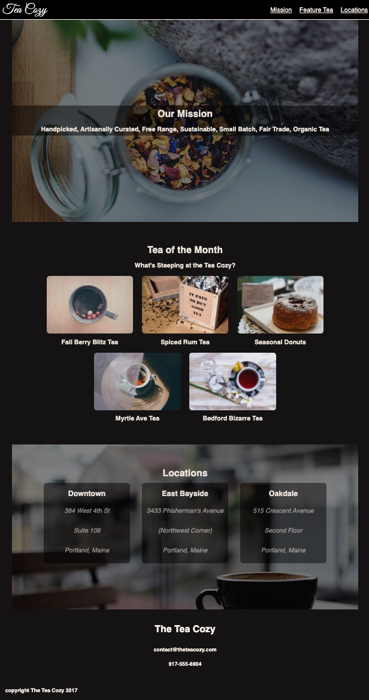

# Off-Platform Project: Tea Cozy

### Project Description

In this project, you will create a fictional tea shop website.

We will provide a design spec (an image of a web page outlined with all of its CSS propertie and values).

These are usually created by a designer as a source of instructions for a web developer.

This project assumes that you will be able to reproduce the basic HTML and CSS with little guidance.

### Design Spec

### Final Version

